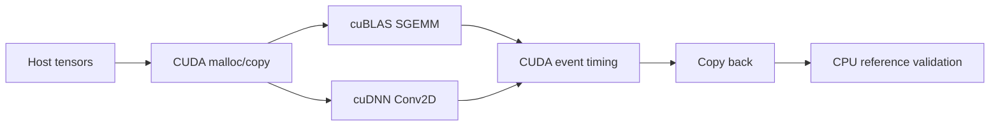

# CUDA Linear Algebra Bench — cuBLAS + cuDNN

A compact CUDA benchmarking project that compares hand-written CUDA kernels with NVIDIA library primitives for matrix multiplication and convolution.

## What it demonstrates

- cuBLAS SGEMM with explicit device buffers and CUDA events
- cuDNN 2D convolution with tensor/filter/convolution descriptors
- Numerical validation against CPU reference results
- Repeatable warm-up + timed iterations
- CMake integration with CUDA, cuBLAS, and cuDNN
- Jenkins build pipeline for GPU-capable workers

## Architecture



## Build

```bash
cmake -S . -B build
cmake --build build -j
./build/cuda_linear_bench
```

## Output

The executable prints measured SGEMM/Conv2D latency and max absolute error. Numbers are measured at runtime; this repository does not claim fabricated benchmark results.

## Resume-safe description

Built a CUDA benchmarking harness using cuBLAS and cuDNN with explicit GPU memory management, CUDA event timing, and numerical validation against CPU references.

## License

MIT
